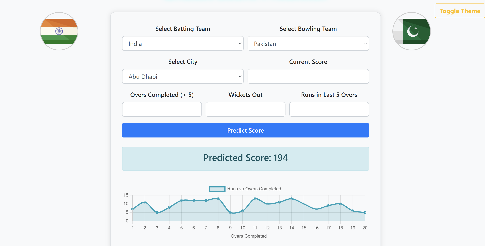

# 🏏 Cricket Score Predictor

<table>
<tr>
<td align="center">
  
  <br><sub><b>Form Input with Flags</b></sub>
</td>
<td align="center">
  
  <br><sub><b>Prediction Result and Chart</b></sub>
</td>
</tr>
</table>
---


A **Machine Learning-based web application** that predicts the final score of a T20 cricket match based on match data. Built using **Flask** for the backend and **HTML/CSS/JS** for a modern, responsive frontend.

---

## 💡 Features

- 🧠 Predicts final match score based on live match conditions
- ⚙️ Trained machine learning model (Linear Regression)
- 🌐 Flask-powered backend with dynamic HTML rendering
- 🎨 Toggleable light/dark themes
- 📊 Runs vs Overs chart using Chart.js
- 🖼️ Country flags and interactive layout

---

## 🔥 Why Flask?

Flask is a lightweight and flexible Python web framework used to:

- Serve the HTML UI using templates (Jinja2)
- Handle form submission via POST requests
- Load and use a pre-trained ML model (`model.pkl`)
- Return prediction results back to the frontend
- Serve static assets (images, CSS, JS)

### Flask Routes

```python
@app.route("/", methods=["GET", "POST"])
def home():
    if request.method == "POST":
        # extract form values
        # make prediction using loaded model
        # return prediction to template
    return render_template("index.html", prediction=predicted_score)
